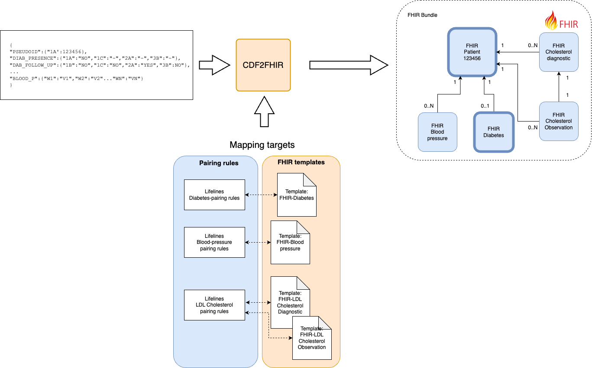
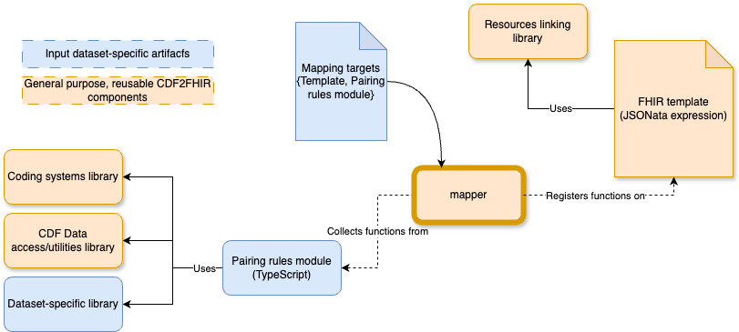
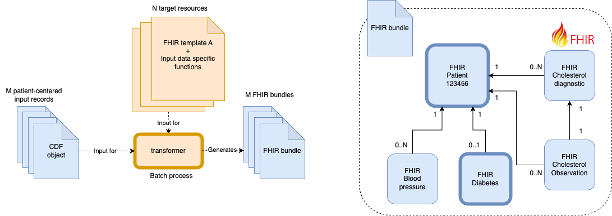

# CDF2FHIR overview

!!! warning "Under Development"
    
    This tool is under active development. The documentation is not complete yet. If you have any 
    questions, please contact us via [GitHub Issues](https://github.com/MyDigiTwinNL/CDF2Medmij-Mapping-tool/issues)

CDF2FHIR, is a command line tool that performs a batch transformation process from cohort-study data into FHIR-compliant one. As illustrated in the diagram below, it uses as an input (1) the cohort data represented formatted with the CDF convention, and (2) a set of targets, that is to say the FHIR resources that are intended to be created based on the cohort data. 

Each target is defined, in turn, by selecting one of the previously defined FHIR templates (e.g., Problem, Condition, Laboratory result, etc.) and pairing it with a module where the logic of the transformation between the source and the target values is defined. 




## CDF2FHIR design at a glance

At its core, the CDF2FHIR tool is built on top of JSONata, a lightweight query and transformation language specifically designed for JSON data. JSONata provides a simple yet powerful syntax for extracting, filtering, and transforming data within JSON documents. The language supports a wide range of built-in functions, including $map, $filter, $sort, $reduce, and $merge, among others. These functions allow for sophisticated data manipulation and transformation tasks, such as transforming an array of values, filtering values based on a specific condition, sorting values, reducing an array to a single value, and merging multiple objects into one. 

To illustrate how CDF2FHIR extends and tailor JSONata for health-data transformation purposes, let's examine how a transformation would be performed using only the core of JSONata. Assume that the variable on input data below will be used to generate part of a FHIR blood-lab test resource. In this case, the 'interpretation' element of the target FHIR resource need to be included with the SNOMED code 281302008 only if the value of the hba1cconc_result_all_m_1 variable, in assessment '1a' is above 42.

```
{
    "hba1cconc_result_all_m_1":{ "1a": "43", "2a":"44"},
}
```

Using JSONata's syntax, this 'transformation rule' could be implemented as follows:

```
...
{
 "interpretation": hba1cconc_result_all_m_1["1a"] > 42 ? {
    "coding": [
      {
        "system": "http://snomed.info/sct",
        "code": 281302008
      }
    ]
 } : {}
}
...
```

Although the output generated by the expresion above would be valid, having the output format coupled with the logic would make the process of implementing these rules at scale (multiple variables, for multiple datasets) time cosuming and unreliable. On the one hand, the format-related elements would be duplicated across every variant of a resource (e.g., having the format of the LabTestResult FHIR duplicated across multiple types of blood tests), leading to maintainability issues. On the other hand, this coupling makes it cumbersome to ensure accuracy and robustness of the rules by impeding proper testing. Moreover, the generation of consistent and valid FHIR resources involves other complex tasks, including the computation of unique identifiers, and using them consistently to make references between resources. 


The CDF2FHIR tool adds robustness and a proper separation of concerns by hiding most of this complexity from the process. As illustrated in the diagram below, the tool provides (1) a series of reusable templates for generating multiple types of FHIR resources (and a development environment to create new ones if needed), and (2) a series of libraries with the functions needed for the implementation of the pairing rules, incluiding the processing of the input data, and the management of coding systems (SNOMED, Loinc, etc). With this, to include a given FHIR resource as part of the transformation output, all that is needed is to implement the pairing rules as a TypeScript module (following an TypeScript interface previously defined, which enforces types consistency). 



These pairing-rule modules, by being decoupled from the 'output-generation' concerns, can be developed following a test-based approach. That is to say, by first specifying the pairing rules, and then developing a series of test cases to guide the actual implementation. Let's illustrate this with the especification of a rule describing how to transform two variables from the original input dataset, into the 'result' element of a LaboratoryTestResult FHIR resource:

```
/**
 * A laboratory result describes the result of a laboratory analysis. These are specimen-oriented 
 * tests as performed in laboratories such as Clinical Chemistry, Serology, Microbiology, etc. 
 * In addition to the results of tests with a singular result, this concept can also contain 
 * the results of more complex tests with multiple results or a ‘panel’.
 * 
 * 
 * Related variables:
 * ------------------------------------------------------------------
 *                                [1A][1B][1C][2A][3A][3B]
 * creatinine_result_all_m_1      [X ][  ][  ][X ][  ][  ]
 * date                           [X ][X ][X ][X ][X ][X ]
 * ------------------------------------------------------------------
 * 
 * @return, for each assessment:
 *      [[assessment_N]:
 *          - result: creatinine_result_all_m_1 in assessment_N
 *          - resultcoding: {"system": "http://loinc.org","code": "14682-9","display": "Creat SerPl-sCnc"}
 *          - resultunits: {"unit": "umol/l","system": "http://unitsofmeasure.org","code": "umol/L"}
 *          - resultFlag: if gender == male:
 *                            if creatinine_result_all_m_1 in assessment_N > 110.0 mmol/L:
 *                               {code:281302008, system:http://snomed.info/sct}
 *                            elif creatinine_result_all_m_1 in assessment_N < 50.0 mmol/L:
 *                               {code:281300000, system:http://snomed.info/sct}
 *                        elif gender == female:
 *                            if creatinine_result_all_m_1 in assessment_N > 90.0 mmol/L:
 *                               {code:281302008, system:http://snomed.info/sct}
 *                            elif creatinine_result_all_m_1 in assessment_N < 50.0 mmol/L:
 *                               {code:281300000, system:http://snomed.info/sct}
 *          - collectedDateTime: date of assessment_N         
 * 
 */

export const creatinine:LaboratoryTestResult = 
...
```

Based on this specification, test cases like the following, could be implemented for multiple scenarios to ensure a correct implementation what was specified:

```
test('Creatinine conceptration for male participant, above limit', () => {

  const input = {
   
    "creatinine_result_all_m_1" :{ "1a": "111", "2a":"120"},//in mmol/L
    "gender" : { "1a":"MALE"},
    "date": {/*date1*/ "1a":"1990-1","1b":"1995-5","1c":"1997-5",/*date2*/"2a":"2000-1","3a":"2003-5","3b":"2005-5"},
    "age": { "1a": "40" },  //age on "2a": 50  
    "project_pseudo_id": { "1a": "520681571" },
  }  

  
  InputSingleton.getInstance().setInput(input);
  const results = creatinine.results();
  expect(results.length).toBe(2);  
  expect((results[0] as TestResultEntry).testResult).toBe(111)
  expect((results[0] as TestResultEntry).resultFlags?.display).toBe("Above reference range")
  expect((results[1] as TestResultEntry).testResult).toBe(120)  
  expect((results[1] as TestResultEntry).resultFlags?.display).toBe("Above reference range")


});
```

Once the modules with the pairing rules are developed, the tool 'injects' all the functions (standard ones, and the ones created for the pairing rules) on each JSONata templates, according to series of 'Mapping targets', a configuration defining which pairing rules will be used with which templates.

Once all the templates are created, the bach process of the diagram below is performed: each input resource (which correspond to a single cohort study participant) is transformed into multiple FHIR resources, which are then linked and aggregated as a single FHIR resource.



